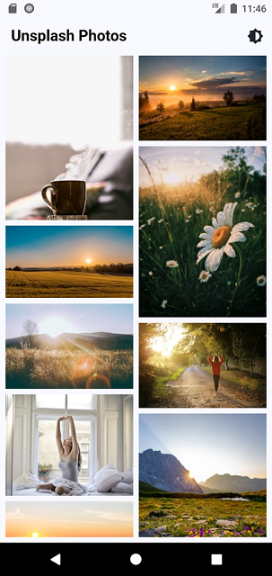

# Flutter Image Gallery

This is a simple Flutter application that fetches and displays images from the Unsplash API based on
the time of day. The application will show different images for morning, afternoon, evening, and
night.

## Key Features
**Time-Based Image Display:** The app will display different images for different times of the day (morning, afternoon, evening, night).

**Unsplash API Integration:** Use Unsplash API to fetch high-quality images.

**Responsive UI:** Ensure the UI is responsive and works well on various screen sizes.

## Technical Features | Libraries & Tools Used:
* Home
* REST API ([Dio](https://github.com/flutterchina/dio))
* State Management ([Flutter Bloc](https://pub.dev/packages/flutter_bloc))
* Functional Error Handling ([fbdart](https://pub.dev/packages/fb_dart))
* Json Serialization ([json_serializable](https://pub.dev/packages/json_serializable))
* Code Generation ([build_runner](https://pub.dev/packages/build_runner))
* Network Image Caching ([cached_network_image](https://pub.dev/packages/cached_network_image))
* Logging ([logger](https://pub.dev/packages/logger), [pretty_dio_logger](https://pub.dev/packages/pretty_dio_logger))
* Dependency Injection ([get_it](https://pub.dev/packages/get_it))
* Infinite Scroll Pagination ([infinite_scroll_pagination](https://pub.dev/packages/infinite_scroll_pagination))
* Theme Switcher (Cubit)
* Dark Theme Support
* Unit Tests
* MVC | MVVM | Clean Architecture

## Screenshots


## Video


## Todo
- [x] Implement Time-Based Display Logic in a helper class.
- [x] Integrate with Unsplash API to fetch images based on predefined time segments (morning, afternoon, evening, night)..
- [x] Display the appropriate images for the current time segment in a grid layout with infinite scroll.
- [x] Implement a loading indicator while images are being fetched.
- [x] Provide pull to refresh action to manually refresh the images.
- [x] Allow users to tap on a photo to view it in full-screen mode.
- [ ] Implement a responsive UI that works well on various screen sizes.
- [x] Cache images locally to reduce loading time.
- [ ] Cache API responses to reduce network calls.
- [ ] Implement a flexible app configuration to easily switch between development and production APIs.
- [x] Write unit tests
- [ ] Write integration tests

## How to Use

**Step 1:**

Download or clone this repo by using the link below:

```
https://github.com/rezwanul7/flutter_gallery_app.git
```

**Step 2:**

Go to project root and execute the following command in console to get the required dependencies:

```
flutter pub get 
```

**Step 3:**

This project uses `json_serializable` library that works with code generation, execute the following command to generate files:

```
flutter packages pub run build_runner build --delete-conflicting-outputs
```

or watch command in order to keep the source code synced automatically:

```
flutter packages pub run build_runner watch
```

### Folder Structure
Here is the core folder structure which flutter provides.

```
flutter-app/
|- android
|- build
|- ios
|- lib
|- test
```

Here is the folder structure we have been using in this project

```
lib/
|- core/
    |- constants/
    |- error/
    |- network/
    |- themes/
    |- usecases/
    |- utils/
    |- widgets/
|- features/
    |- home/
        |- data/
            |- datasources/
            |- models/
            |- repositories/
        |- domain/
            |- entities/
            |- repositories/
            |- usecases/
        |- presentation/
            |- blocs/
            |- controllers/
            |- pages/
            |- widgets/
|- main.dart
|- app.dart
|- injection_container.dart
```

Now, lets dive into the lib folder which has the main code for the application.

```
1- core - All the shared code will be here.
2- features - Contains all the features of the application.
3- main.dart - This is the starting point of the application.
4- app.dart - This is the main widget of the application.
5- injection_container.dart - This is the place where all the dependency injection is being handled.
```
